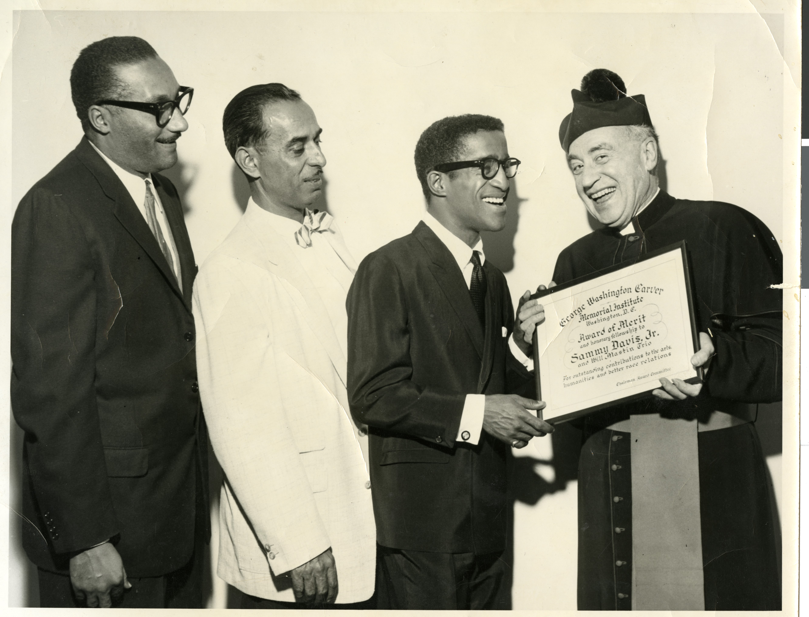

<link rel="stylesheet" href="style.css">

<p align="left">
  <a href="https://darnellemelvin.github.io/from-negatives-to-knowledge">
    
  </a>
</p>

# 🧠 Hands-On Activities

## Activity 1. Entity Annotation
Look at this sample image from the Marie and James B. McMillan Photograph Collection (PH-00334).  

## 👀 Who can you identify?

<div style="text-align: center; margin-bottom: 1em;">
  
</div>

<div style="text-align: center; margin-bottom: 2em;">
  <button id="showButton" onclick="showCaption()" style="padding: 10px 20px; font-size: 1em; background-color: #810100; color: white; border: none; border-radius: 5px; cursor: pointer;">
    Show Caption
  </button>

  <button id="hideButton" onclick="hideCaption()" style="display: none; padding: 10px 20px; font-size: 1em; background-color: #555; color: white; border: none; border-radius: 5px; cursor: pointer;">
    Hide Caption
  </button>
</div>

<div id="captionBox" style="display: none; text-align: center; background: #f9f9f9; padding: 1em; border: 1px solid #ccc; border-radius: 8px; max-width: 80%; margin: auto;">
  <p><strong>Caption</strong>: Transcribed from attachment on the back of the photo: "Sands Hotel before 1962 left to right Dr. James B. McMillan, Dr. Charles I. West, Sammy Davis, Jr., Mons. James B. Empey, Pastor of St. Joan of Arc Catholic Church. Presenting an "Award of Merit and honorary fellowship" to Sammy Davis, Jr. and Will Mastin Trio from the George Washington Carver Memorial Institute of Washington, D. C. for outstanding contributions to the arts, humanities, and better race relations."

    
Sands Hotel and Casino: 3355 Las Vegas Boulevard South</p> 

<p><strong>Citation</strong>: ohr000452. Marie and James B. McMillan Photograph Collection, 1900-1994. PH-00334. Special Collections and Archives, University Libraries, University of Nevada, Las Vegas. Las Vegas, Nevada. <a href="http://n2t.net/ark:/62930/d1959g30x">http://n2t.net/ark:/62930/d1959g30x</a></p>
</div>

<script>
  function showCaption() {
    document.getElementById('captionBox').style.display = 'block';
    document.getElementById('showButton').style.display = 'none';
    document.getElementById('hideButton').style.display = 'inline-block';
  }

  function hideCaption() {
    document.getElementById('captionBox').style.display = 'none';
    document.getElementById('showButton').style.display = 'inline-block';
    document.getElementById('hideButton').style.display = 'none';
  }
</script>

---

### 🗂 Part 2: Mapping Concepts to Classes

Now that you’ve reviewed the caption, let’s examine how key entities in the photo can be represented using [Schema.org classes](https://schema.org/docs/full.html).

**Prompt:** Read the caption and explore how each of the following Schema.org classes applies to people, groups, organizations, and places mentioned.

Click each class below to reveal the corresponding values:

<details>
<summary><strong>schema:Person</strong></summary>

<ul>
  <li>Dr. James B. McMillan</li>
  <li>Dr. Charles I. West</li>
  <li>Sammy Davis, Jr.</li>
  <li>Mons. James B. Empey</li>
</ul>
</details>

<details>
<summary><strong>schema:PerformingGroup</strong></summary>

<ul>
  <li>Will Mastin Trio</li>
</ul>
</details>

<details>
<summary><strong>schema:Organization</strong></summary>

<ul>
  <li>George Washington Carver Memorial Institute</li>
</ul>
</details>

<details>
<summary><strong>schema:CatholicChurch</strong></summary>

<ul>
  <li>St. Joan of Arc Catholic Church</li>
</ul>
</details>

<details>
<summary><strong>schema:Place</strong></summary>

<ul>
  <li>Sands Hotel and Casino (3355 Las Vegas Boulevard South)</li>
</ul>
</details>

---

**💡 Try this:**  
Using <strong>Part 2: Mapping Concepts to Classes</strong> as a reference, write out a few RDF triples (in Turtle or natural language) that describes an entity.

<textarea rows="10" style="width:100%; font-family: monospace;">
@prefix schema: <http://schema.org/> .
@prefix ex: <http://example.org/> .
@prefix xsd: <http://www.w3.org/2001/XMLSchema#> .
  
ex:stJoanOfArcCathChurch a [SELECT a Schema Class] ;
    schema:name "St. Joan of Arc Catholic Church"@en .

    
</textarea>

> _Bonus challenge:_ Can you find a Wikidata Q-ID or a uri from a name authority file for any of the people, places, or organizations listed?


---

## Activity 2. Modeling Scenario and Writing RDF
Understanding how to express structured metadata in RDF is key to building your knowledge graph. Below is an example using real entities from the project.

### 📄 RDF Triple Structure in Turtle Syntax

```turtle
@prefix schema: <http://schema.org/> .
@prefix skos: <http://www.w3.org/2004/02/skos/core#> .
@prefix agrelon: <https://d-nb.info/standards/elementset/agrelon#> .
@prefix unl: <https://special.library.unlv.edu/taxonomy/term/> .
@prefix xsd: <http://www.w3.org/2001/XMLSchema#> .
@prefix rdfs: <http://www.w3.org/2000/01/rdf-schema#> .

unl:16527 a schema:Person ;
    skos:prefLabel "West, Charles I., 1908-1984"@en ;
    skos:note "American doctor, civil rights activist, and newspaper publisher."@en ;
    schema:name "Charles I. West"@en ;
    skos:inScheme unl: ;
    agrelon:HasSpouse unl:27781 ;
    agrelon:hasChild unl:17559 ;
    schema:birthDate "1908-09-27"^^xsd:date ;    
    schema:deathDate "1984-10"^^xsd:date ;
    skos:exactMatch <http://id.loc.gov/authorities/names/no2019080699> ;
    skos:closeMatch <http://www.wikidata.org/entity/Q105758712> ;
    rdfs:seeAlso <http://n2t.net/ark:/62930/f13t22> .
```
This example uses Schema.org, SKOS, and Agrelon vocabularies to model relationships and biographical metadata. The unl: prefix represents local identifiers from the UNLV taxonomy.  

### 🧾 Explanation of Triples

| Triple Component              | Description                                                               |
| ----------------------------- | ------------------------------------------------------------------------- |
| `a schema:Person`             | Declares the resource as a person class using Schema.org                  |
| `skos:prefLabel`              | The preferred label or name of the person                                 |
| `skos:note`                   | A brief biographical note or description                                  |
| `schema:name`                 | The name of the item (in direct order)                                    |
| `skos:inScheme unl:`          | Indicates this term belongs to the UNLV controlled vocabulary             |
| `agrelon:HasSpouse unl:27781` | Relationship link to a spouse entity                                      |
| `agrelon:hasChild unl:17559`  | Relationship link to a child entity                                       |
| `schema:birthDate`            | The person's birthdate in ISO format using the XML Schema datatype        |
| `schema:deathDate`            | The person's deathdate in ISO format using the XML Schema datatype        |
| `skos:exactMatch`             | Links to a matching external authority record (e.g., Library of Congress) |
| `skos:closeMatch`             | Links to a matching external authority record (e.g., Wikidata, Dbpedia)   |
| `rdfs:seeAlso`                | Further information about the subject resource                            |

**✏️ Task:**    
Using the example URIs and classes below, write RDF statements to describe the entities using the `a` keyword (for rdf:type) and appropriate Schema.org and skos properties.

### Building on Classes from Activity 1

| Entity                                      | URI                                                   | Class (click on Class to explore their properties)                                                                                           |
| ------------------------------------------- | -----------------------------------------------------------------------------------------------------------------------  | ------------------------------------------------------------------------- |
| Sammy Davis, Jr.                            | <a href="https://special.library.unlv.edu/taxonomy/term/3454">https://special.library.unlv.edu/taxonomy/term/3454</a>    | <a href="https://schema.org/Person">`schema:Person`</a>                   |
| Will Mastin Trio                            | <a href="https://special.library.unlv.edu/taxonomy/term/9834">https://special.library.unlv.edu/taxonomy/term/9834</a>    | <a href="https://schema.org/PerformingGroup">`schema:PerformingGroup`</a> |
| Mons. James B. Empey                        | <a href="https://special.library.unlv.edu/taxonomy/term/28078">https://special.library.unlv.edu/taxonomy/term/28078</a>  | <a href="https://schema.org/Person">`schema:Person`</a>                   |
| St. Joan of Arc Catholic Church             | <a href="https://special.library.unlv.edu/taxonomy/term/28100">https://special.library.unlv.edu/taxonomy/term/28100</a>  | <a href="https://schema.org/CatholicChurch">`schema:CatholicChurch`</a>   |
| Sands Hotel & Casino                        | <a href="https://special.library.unlv.edu/taxonomy/term/11258">https://special.library.unlv.edu/taxonomy/term/11258</a>  | <a href="https://schema.org/Place">`schema:Place`</a>                     |

<textarea rows="10" style="width:100%; font-family: monospace;">
@prefix skos: <http://www.w3.org/2004/02/skos/core#> .
@prefix unl: <https://special.library.unlv.edu/taxonomy/term/> .
@prefix xsd: <http://www.w3.org/2001/XMLSchema#> .
@prefix schema: <http://schema.org/> .
  

</textarea>

**💡 Try This:**
Use the following entities to write your own RDF triples:

<a href="https://special.library.unlv.edu/taxonomy/term/13280">`unl:13280`</a> Las Vegas voice  

<a href="https://special.library.unlv.edu/taxonomy/term/17776">`unl:17776`</a> Clinton Wright  

<a href="https://special.library.unlv.edu/taxonomy/term/27746">`unl:27746`</a> Arkansas Agricultural, Mechanical, and Normal College  

<textarea rows="10" style="width:100%; font-family: monospace;">
@prefix skos: <http://www.w3.org/2004/02/skos/core#> .
@prefix unl: <https://special.library.unlv.edu/taxonomy/term/> .
@prefix xsd: <http://www.w3.org/2001/XMLSchema#> .
@prefix schema: <http://schema.org/> .
  

</textarea>

**Focus on:**

* Assigning the correct class using `a` (short for `rdf:type`)

* Using `skos:prefLabel` and `schema:name` for the labels

* Using `skos:note` for a description

* Describing relationships using properties like `schema:memberOf`, `schema:member`, `schema:alumniOf`, `schema:alumni`,  or `schema:affiliation`

* Linking entities to external name authority files via `skos:closeMatch` or `skos:exactMatch` 

--- 

## Activity 3. SPARQL Challenge
Use our [example dataset](queries.md) and try this:
```sparql   
SELECT ?person ?relation ?relatedPerson
WHERE {
  ?person a schema:Person .
  ?person agrelon:hasFamilyRelation ?relatedPerson .
  ?person rdfs:label ?name .
}
```

---

<p style="text-align: right; margin-top: 2em;">
  <a href="https://special.library.unlv.edu/">
  
  </a>
</p>
