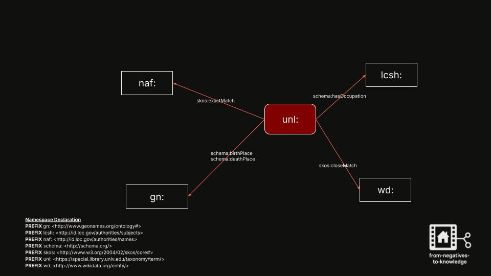
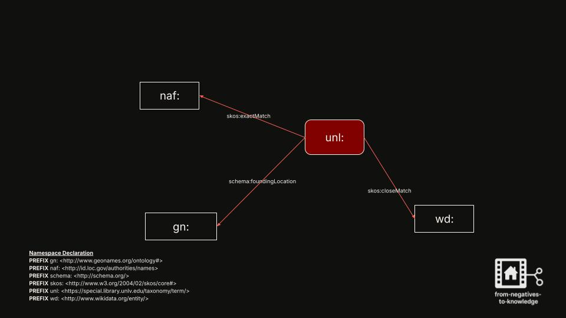
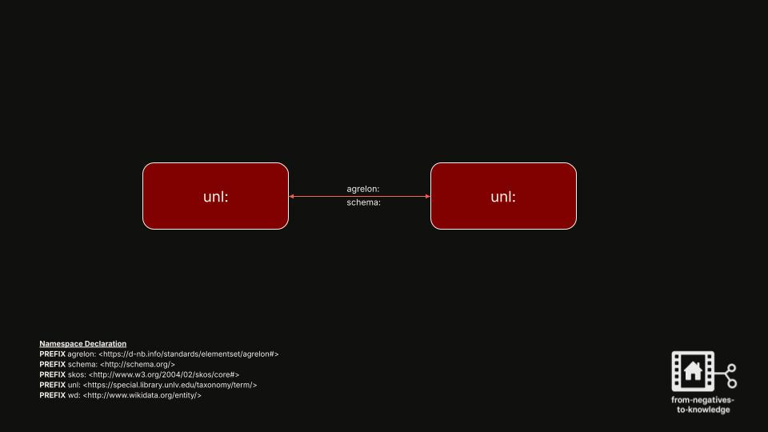

<link rel="stylesheet" href="style.css">

  

# Data Modeling

This page provides an overview of how entities, relationships, and vocabulary terms are modeled in the knowledge graph supporting *From Negatives to Knowledge*. Modeling decisions help align local metadata with widely adopted vocabularies such as `schema.org`, `skos`, `GeoNames`, and `lcsh`.

---

## 🖼️ Visualizing Modeling Decisions

Below are conceptual diagrams showing how key entity types are modeled and linked to external vocabularies:

### 📌 1. `schema:Person` Modeling Decisions

  

A diagram showing how a `schema:Person` is modeled using properties like `birthDate`, `occupation`, and connections to external sources.

---

### 📌 2. `schema:Organization` Modeling Decisions

  

This diagram models various types of organizations—such as schools, churches, and businesses—using appropriate `schema:Organization` subclasses and descriptive properties.

---

### 📌 3. `unl:` Modeling Decisions (Node-to-Node Linking) 

  

This conceptual graphic shows how one `unl:` node is connected to another `unl:` node using semantic relationships drawn from vocabularies such as `agrelon:` and `schema:`. These links capture real-world relationships like affiliation, employment, or organizational roles within the graph.

---

  

