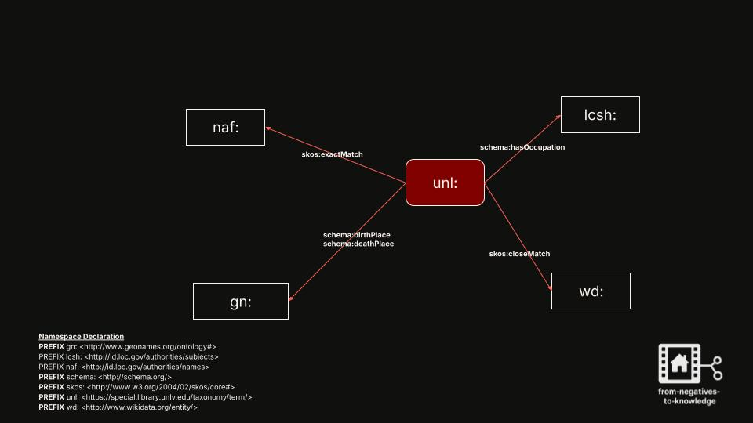
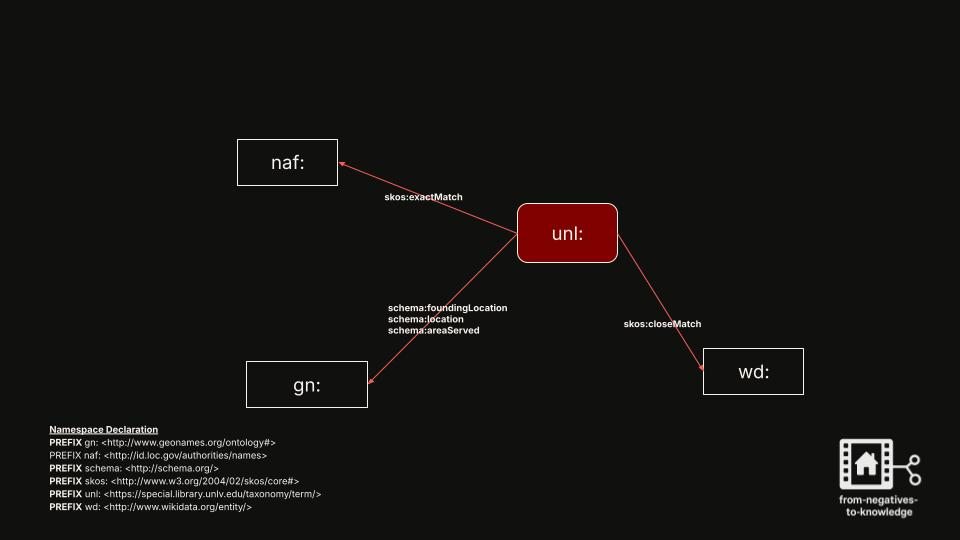

<link rel="stylesheet" href="style.css">

  

# Data Modeling

This page provides an overview of how entities, relationships, and vocabulary terms are modeled in the knowledge graph supporting *From Negatives to Knowledge*. Modeling decisions help align local metadata with widely adopted vocabularies such as `schema.org`, `skos`, `GeoNames`, and `lcsh`.

---

## 🧾 Property Guidelines

The following tables outline the **required** and **recommended** properties used when modeling entities in this project:

<table style="width:100%; border-collapse: collapse; margin-top: 1em;">
  <tr>
    <th style="width:50%; text-align: left; border-bottom: 2px solid #ccc;">Required Properties</th>
    <th style="width:50%; text-align: left; border-bottom: 2px solid #ccc;">Recommended Properties</th>
  </tr>
  <tr>
    <td><code>schema:name</code></td>
    <td><code>rdfs:seeAlso</code></td>
  </tr>
  <tr>
    <td><code>skos:prefLabel</code></td>
    <td><code>skos:closeMatch</code></td>
  </tr>
  <tr>
    <td><code>rdf:type skos:Concept</code></td>
    <td><code>skos:exactMatch</code></td>
  </tr>
  <tr>
    <td><code>rdf:type [Select a schema class or subClass]</code></td>
    <td><code>skos:altLabel</code></td>
  </tr>
  <tr>
    <td><code>skos:note</code></td>
    <td></td>
  </tr>
  <tr>
    <td><code>skos:inScheme unl:</code></td>
    <td></td>
  </tr>
</table>

---

## 🧭 Namespace Declaration

In RDF data modeling, **namespace declarations** define shorthand prefixes for longer URIs. These prefixes allow for clean, readable references to commonly used vocabularies across your RDF data and SPARQL queries.

The following namespaces are used in this project:

 
@prefix agrelon: <https://d-nb.info/standards/elementset/agrelon#>   
@prefix dct:     <http://purl.org/dc/terms/>  
@prefix gn:      <http://www.geonames.org/ontology#>   
@prefix lcsh:    <http://id.loc.gov/authorities/subjects/>   
@prefix naf:     <http://id.loc.gov/authorities/names/>   
@prefix rdf:     <http://www.w3.org/1999/02/22-rdf-syntax-ns#>   
@prefix rdfs:    <http://www.w3.org/2000/01/rdf-schema#>   
@prefix schema:  <http://schema.org/>   
@prefix skos:    <http://www.w3.org/2004/02/skos/core#>   
@prefix unl:     <https://special.library.unlv.edu/taxonomy/term/>   
@prefix wd:      <https://www.wikidata.org/entity/>  
@prefix xsd:     <http://www.w3.org/2001/XMLSchema#>   

For a full list of namespace declarations see my library Linked Data <a href="https://github.com/darnelleMelvin/libraryLinkedData_namespaces" target="_blank">Namespaces Repo</a>.

---

## 🖼️ Visualizing Modeling Decisions

Below are conceptual diagrams showing how key entity types are modeled and linked to external vocabularies:

### 📌 1. `schema:Person` Modeling Decisions

  

A diagram showing how a `schema:Person` is modeled using properties like `birthDate`, `birthPlace`, `deathPlace`, `hasOccupation`, and connections to external authority files using `skos:closeMatch` and `skos:exactMatch`.

---

### 📌 2. `schema:Organization` Modeling Decisions

  

This diagram models various types of organizations—such as schools, churches, and businesses—using appropriate `schema:Organization` subclasses and descriptive properties.

---

### 📌 3. `unl:` Modeling Decisions (Node-to-Node Linking) 

  

This conceptual graphic shows how one `unl:` node is connected to another `unl:` node using semantic relationships drawn from vocabularies such as `agrelon:` and `schema:`. These links capture real-world relationships like affiliation, employment, or organizational roles within the graph.

---

