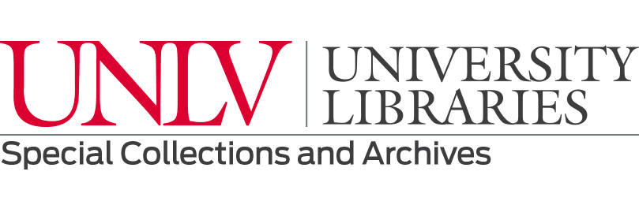

<link rel="stylesheet" href="style.css">

# From Negatives to Knowledge: Linking Community Archives with RDF
### Workshop Facilitated by Darnelle Melvin and Cory Lampert

Welcome to the workshop site! This workshop explores how a digitized photographic collection documenting Las Vegas’s Historic Westside was transformed into a knowledge graph using linked data principles.

🔗 Start with the [Workshop Agenda](agenda.md)  
🧠 Try the [Hands-On Activities](activities.md)  
📊 Explore our [SPARQL Queries](queries.md)  
📚 Learn more [About the Project](about.md)

  

