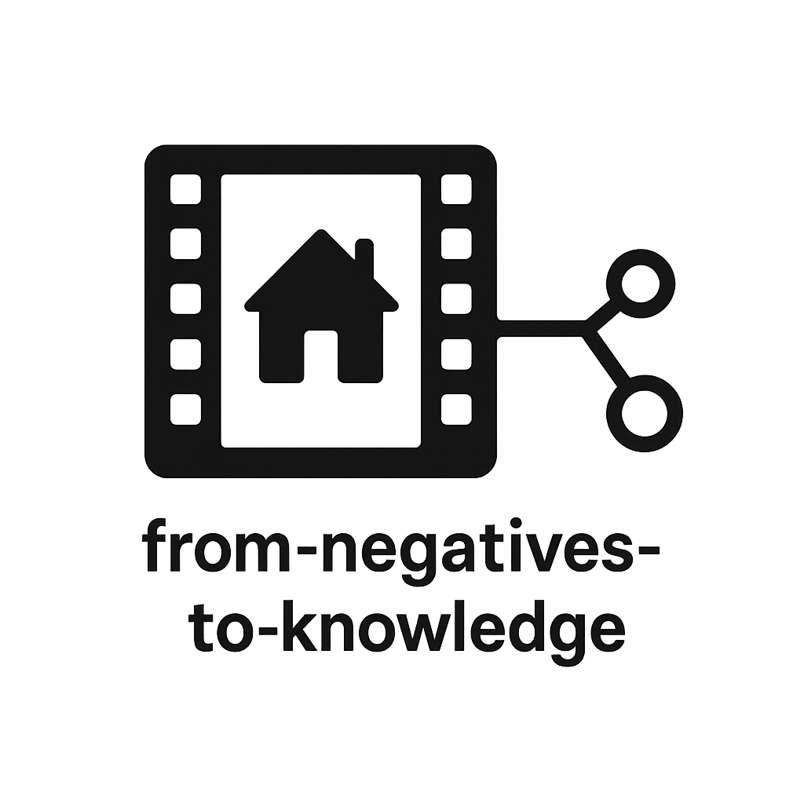

  

<link rel="stylesheet" href="style.css">

<!---
#<iframe src="rdf_graph.html" style="width:100%; height:650px; border:none;"></iframe>
--->

## 2025 LD4 Confernece on Linked Data July 28-30, 2025
### Workshop Facilitated by Darnelle Melvin and Cory Lampert on Monday, July 28, 2025.

Welcome to the workshop site! This workshop explores how a digitized photographic collection documenting Las Vegas’s Historic Westside was transformed into a knowledge graph using linked data principles.

🗓 Start with the [Workshop Agenda](agenda.md)  
📚 Learn more [About the Project](about.md)  
 See our [Modeling Decisions](dataModel.md)  
🧩 Learn about the [Classes and Properties used in our Knowledge Graph](classes.md)  
🧠 Try the [Hands-On Activities](activities.md)  
📊 Explore some [SPARQL Queries](queries.md)  
🔗 Essential [Resources Related to the Project](resources.md)  
📽️ View our [Workshop Slides](slides.md)  

---

